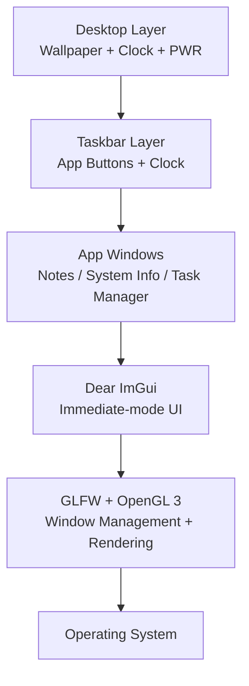

# CSOPESY Desktop-Style OS Mock-up

## Author & Entry Point

- **Course:** CSOPESY — Semi-Major Output 2
- **Entry file:** `main.cpp` — contains the `main()` function

## Build & Run Instructions

### Prerequisites
- **Compiler:** MinGW-W64 g++ (tested with g++ 16.2.0)
- **Libraries:** GLFW 3 and OpenGL (included in repo under `glfw/`)
- **Dear ImGui:** Included in repo under `imgui/`

### Compile Command

```bash
g++ main.cpp imgui/imgui*.cpp imgui/backends/imgui_impl_glfw.cpp imgui/backends/imgui_impl_opengl3.cpp -o app.exe -I imgui -I imgui/backends -I glfw/include -L glfw/lib-mingw-w64 -lglfw3 -lopengl32 -lgdi32 -limm32 -static
```

### Run

```bash
./app.exe
```

> **Note:** Close the application using the **PWR** button in the top-right corner (not the native window X button).

## Configurable Parameters

All tweakable values (colors, labels, process data, etc.) are defined as named constants near the top of `main.cpp`. To adjust for grading test cases, edit these values and recompile — no logic changes needed.

## Architectural Diagram

```
┌─────────────────────────────────────────────────────┐
│                    main.cpp                         │
│                                                     │
│  ┌───────────────────────────────────────────────┐  │
│  │              Desktop Layer                    │  │
│  │  • Gradient wallpaper (full-screen)           │  │
│  │  • Grid pattern overlay                       │  │
│  │  • Real-time clock (bottom-right)             │  │
│  │  • PWR shutdown button (top-right)            │  │
│  └───────────────────────────────────────────────┘  │
│                       │                             │
│  ┌───────────────────────────────────────────────┐  │
│  │              Taskbar Layer                    │  │
│  │  • Fixed bottom panel                         │  │
│  │  • [Notes] [System Info] [Task Mgr] buttons   │  │
│  │  • Taskbar clock (right side)                 │  │
│  └───────────────────────────────────────────────┘  │
│                       │                             │
│  ┌───────────────────────────────────────────────┐  │
│  │           Application Windows                 │  │
│  │  • Notes (text editor placeholder)            │  │
│  │  • System Info (hardware info placeholder)    │  │
│  │  • Task Manager (process table with           │  │
│  │    CPU%, Memory, Status columns)              │  │
│  └───────────────────────────────────────────────┘  │
│                       │                             │
├───────────────────────┼─────────────────────────────┤
│                 Dear ImGui                          │
│        (Immediate-mode UI framework)                │
├───────────────────────┼─────────────────────────────┤
│            GLFW  +  OpenGL 3                        │
│     (Window/Input)   (Rendering)                    │
├───────────────────────┼─────────────────────────────┤
│              Operating System                       │
│          (Windows / macOS / Linux)                   │
└─────────────────────────────────────────────────────┘
```

### Mermaid Diagram



## Features

| Feature | Description |
|---------|-------------|
| **Desktop** | Full-screen gradient wallpaper with subtle grid pattern |
| **Real-time Clock** | System clock displayed in bottom-right, updated every frame |
| **PWR Button** | Circular red button in top-right for graceful shutdown |
| **Taskbar** | Fixed bottom panel with 3 application launcher buttons |
| **Notes** | Editable text area with placeholder content |
| **System Info** | Hardware/software info display (dummy data) |
| **Task Manager** | Process table with Name, CPU%, Memory, Status columns |